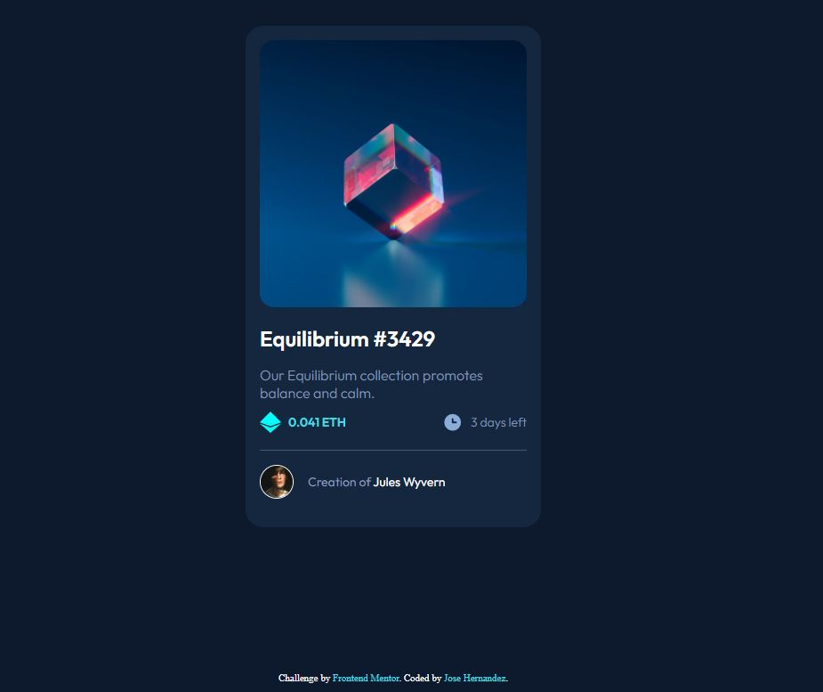

# Frontend Mentor - NFT preview card component solution

Solucion al reto [NFT preview card component challenge on Frontend Mentor](https://www.frontendmentor.io/challenges/nft-preview-card-component-SbdUL_w0U). 

## Table of contents

- [Overview](#overview)
  - [Screenshot](#screenshot)
  - [Links](#links)
- [My process](#my-process)
  - [Built with](#built-with)
  - [What I learned](#what-i-learned)
  - [Continued development](#continued-development)
  - [Useful resources](#useful-resources)
- [Author](#author)
- [Acknowledgments](#acknowledgments)


### Screenshot



### Links

- Solucion URL: (https://josehernandez.falconcode.mx/3-ntf%20prewiew-card-component-main/)

## My process

- Analizamos el reto en cuanto estructura HTML
- Se creo la estructura HTML
- Se desarrollo el codigo CSS necesario
- Se resolvio el tema responsivo
- Se creo la documentación
- Procedí a subir el codigo a producción
- Complementamos subiendo el proyecto a Github

### Built with

- HTML5
- CSS
- Flexbox
- CSS Grid

### What I learned

Se tuvo una complicacion en el proyecto en la cual al crear la card dentro de una seccion .pruebaETH, la card interna se agrandaba deacuerdo a como crecia la caja padre (pruebaETH) por lo que se resolvio centrando el objeto con la propiedad align-items: center;

```css
.pruebaETH{
    width: 100%;
    height: 95vh;
    display: flex;
    justify-content: center;
    /* Agregar align-items center para que no corra al mismo tamaño la card */
    align-items: center; 
}
```

### Continued development

- Flexbox
- Iniciar con Grid

### Useful resources

- W3schools (https://www.w3schools.com/css/css3_flexbox.asp)

## Author

- Website - [falconcode.mx](https://falconcode.mx/)
- Frontend Mentor - [@JozeHernandez](https://www.frontendmentor.io/profile/JozeHernandez)
- Twitter - [@JozeHernandez_](https://twitter.com/JozeHernandez_)

## Acknowledgments

-Oscar Hernandez [GitHub](https://github.com/OscarHernandez98)
